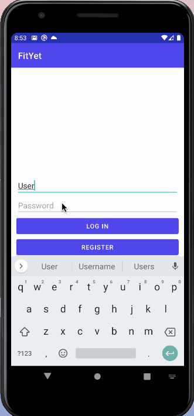

# FitYet

## Table of Contents
1. [Overview](#Overview)
1. [Product Spec](#Product-Spec)
1. [Wireframes](#Wireframes)
1. [Schema](#Schema)

## Overview
### Description
Paces the user in reaching a specific fitness goal using regularly scheduled alarms. The user chooses what type of workout they would like to do; for inexperienced users, they may opt for in-app guided YouTube tutorials; for more experienced users, funky music of their choice plays. 

### App Evaluation
- **Category:** Fitness / Wellness
- **Mobile:** This app would be primarily developed for mobile Android devices.
- **Story:** With an area of improvement indicated on the user’s profile, the app sets regular reminders for the user to complete a set of exercises.
- **Market:** Any individual may use this app, particularly those with high interests in health/fitness.
- **Habit:** This app operates in accordance with the user’s schedule; the user manually inputs their exercise times and those times will trigger an exercise reminder.
- **Scope:** First, the user may track their own progress by completing the sets of exercises. In the future, an interactive feature with other in-app users may come to fruition to promote healthy competition and encouragement.

## Product Spec
### 1. User Stories (Required and Optional)

**Required Must-have Stories**

- [x] User creates a profile to access the appropriate exercises
- [x] User can set fitness goals to achieve
- [ ] After setting goals, user can set a schedule to workout
- [ ] Alarm (or Funky music of users choice from their phone) will beep on the scheduled time as a reminder of the exercise.
- [ ] Alarm- proceed/ dismiss
- [x] App provides guidance for inexperienced user (youtube tutorials for exercises)
- [x] User can browse other exercise tutorials based on their need (One page with different sections/list of exercise)
- [ ] Setting (Change goal, schedule, type of exercise)
- [ ] Progress showing how far/close you are from achieving your goals.

**Optional Nice-to-have Stories**

- [ ] Social interaction with other users
- [ ] Reward system with points 
- [ ] Leaderboard showing top performers amongst your friends

### 2. Screen Archetypes

* Login screen (AHMED)
* Register screen - User signs up/logs into their account (FARIHA)
* Goal creation screen - User states the goal they hope to achieve (LILY)
* Personalized goal screen - User can view goal and exercises (LILY)
* User profile screen - User views their progress and goal (FARIHA)
* Settings screen - User may update information
* Schedule set-up screen - User arranges their own workout schedule (AHMED)
* Schedule view screen - User can view their own schedule (AHMED)
* Youtube guides screen- User can view YouTube tutorials for certain exercises (FARIHA)
* Notification screen- User may either dismiss or commit to workout (LILY)
* Workout screen- User sees visual image and timer while music plays (LILY)
ADDITIONAL
*Videos related to goals screen- User sees list of exercises and videos according to their goals (FARIHA)
*More videos (unrelated to goals) screen - User can browse through more tutorials/videos unrelated to their goals (FARIHA)

  
### 3. Navigation

**Tab Navigation** (Tab to Screen)

* Schedule/Timer
* Goals
* Calendar
* User Profile/Settings
* YouTube guides

Optional:
* Friends-Leaderboard (view friends’ progress)

**Flow Navigation** (Screen to Screen)
* Register screen -> Login screen
* User profile -> Settings screen
* Goal creation screen -> Personalized goals screen
* Schedule set-up screen -> Schedule view
* Notification screen -> Workout screen

## Wireframes

### App Walkthough GIF

## Schema

### Models

User

| Property  | Type  | Description  |
| ------------- | ------------- | ------------- |
| userName  | String  | User name  |
| password  | String  | User password  |
| userPic  | File  | User profile picture  |
| userEmail  | String  | User email address  |
| userHeight  | int  | User height  |
| userWeight  | int  | User weight  |
| userGoal  | String  | User selected fitness goal  |
| progressBar  | int  | Tracks user progress  |
| schedule  | Date  | TBA  |

Exercise

| Property  | Type  | Description  |
| ------------- | ------------- | ------------- |
| daysOfWeek  | int  | Records selected days of week  |
| time  | int/Date  | Records selected time of exercise  |
| description  | String  | Describes to user the workout  |
| exerciseNames  | String Array  | Names/lists of the workouts  |

Schedule

| Property  | Type  | Description  |
| ------------- | ------------- | ------------- |
| preferredDay  | String  | User sets a day/days to workout   |
| preferredTime  | int  | User sets a time to workout   |
| days  | String/int array  | Days (Monday-Sunday) to workout  |

## Networking

**List of network requests by screen**

* Home/Schedule Screen
  * (Create/POST) Create new Exercise object
  * (Read/GET) Query Exercise object
  * (Update/PUT) Update daysOfWeek/times/description
  * (Delete) Delete existing daysOfWeek/times/description

* Timer Screen
  * (Read/GET) Query description
  * (Read/GET) Query progressBar
  * (Update/PUT) Update progressBar

* Goals Screen
  * (Read/GET) Query userGoal
  * (Update/PUT) Update userGoal

* Video Guides Screen
  * (Read/GET) Query userGoal

* User Profile Screen
  * (Read/GET) Query logged-in user object
  * (Update/PUT) Update userPic

**[OPTIONAL] Existing API Endpoints**

YouTube API

* Base URL:  https://www.googleapis.com/youtube/v3

| HTTP Verb  | Endpoint  | Description  |
| ------------- | ------------- | ------------- |
| list  | /videos  | Returns a list of videos that match api request parameters  |
